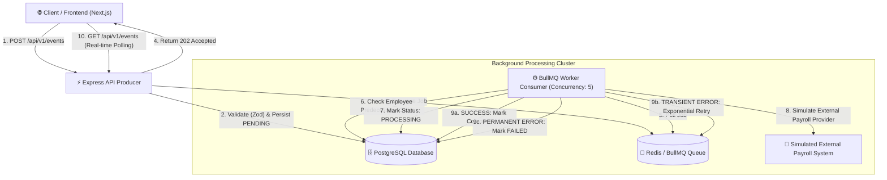

# 💼 Payroll Event Processing Service

> **A high-throughput, resilient, asynchronous event-driven backend service for processing employee payroll lifecycle events.** Built with **Node.js, Express, TypeScript, PostgreSQL, Prisma, Redis, BullMQ, Next.js 16, and Docker**.

---

## 📑 Table of Contents
- [1. System Architecture](#1-system-architecture)
- [2. Technology Stack](#2-technology-stack)
- [3. Key Engineering Highlights & Decisions](#3-key-engineering-highlights--decisions)
- [4. Database & Event Schema](#4-database--event-schema)
- [5. Asynchronous Processing & Queue Design](#5-asynchronous-processing--queue-design)
- [6. Failure Handling, Retries & Idempotency](#6-failure-handling-retries--idempotency)
- [7. Quickstart Guide (Docker)](#7-quickstart-guide-docker)
- [8. Local Development & Testing](#8-local-development--testing)
- [9. API Documentation & Endpoints](#9-api-documentation--endpoints)
- [10. CI/CD Pipeline](#10-cicd-pipeline)

---

## 1. System Architecture

The service decouples synchronous HTTP request ingestion from heavy, slow, or potentially unreliable external payroll processing by employing an **Asynchronous Event-Driven Producer-Consumer Pattern**.



---

## 2. Technology Stack

- **Runtime & Language**: Node.js v20, TypeScript 5.4
- **Backend Framework**: Express.js (Modular Domain-Driven Architecture)
- **Database & ORM**: PostgreSQL 15, Prisma ORM v7 with `@prisma/adapter-pg`
- **Message Broker & Queue**: Redis 7, BullMQ v6
- **Frontend Demonstration**: Next.js 16 (App Router), Tailwind CSS v4, Shadcn UI, Sonner, Lucide
- **Containerization**: Docker, Docker Compose
- **Testing**: Jest, Supertest, ts-jest (13 passing automated unit & integration tests)
- **CI/CD**: GitHub Actions (`.github/workflows/ci.yml`)
- **Logging**: Winston Structured Logger

---

## 3. Key Engineering Highlights & Decisions

### 🎯 Express.js over NestJS
While the initial prompt allowed choosing suitable backend frameworks, **Express.js with TypeScript and clean modular layers (Controller-Service-Route-Validation)** was chosen to provide explicit, transparent control over connection pooling, BullMQ worker lifecycle management, and lightweight container startup without unnecessary framework overhead.

### 🛡️ Non-Blocking Fast Ingestion (HTTP 202 Accepted)
Payroll changes are critical and can take seconds or minutes to clear third-party clearing houses. `POST /api/v1/events` validates requests with **Zod discriminated unions**, writes an immutable record to PostgreSQL with `status = PENDING`, pushes the event to BullMQ, and immediately responds with `202 Accepted` within milliseconds.

### ⏱️ Sequential Event Ordering per Employee (FIFO Guarantee)
Events for different employees process concurrently (concurrency: 5). However, **events belonging to the same employee must never overtake earlier events**. 
- Before processing an event for `employeeId`, the worker queries for any predecessor event for the same employee created earlier that remains in `PENDING` or `PROCESSING` status.
- If an uncompleted predecessor exists, the worker throws an `OrderDependency` error, causing BullMQ to delay/retry the job until the predecessor completes.

---

## 4. Database & Event Schema

```prisma
model Event {
  id            String   @id @default(uuid())
  employeeId    String
  eventType     String   // BANK_ACCOUNT_CHANGE, ADDRESS_CHANGE, SALARY_CHANGE
  status        String   @default("PENDING") // PENDING, PROCESSING, SUCCESS, FAILED
  payload       Json     // Dynamic event attributes
  failureReason String?  // Detailed error message if failed
  createdAt     DateTime @default(now())
  updatedAt     DateTime @updatedAt
}
```

### Supported Event Types & Schemas
1. **`BANK_ACCOUNT_CHANGE`**:
   - `employeeId` (string, required)
   - `effectiveDate` (string, required)
   - `iban` (string, required)
2. **`ADDRESS_CHANGE`**:
   - `employeeId`, `effectiveDate`, `street`, `city`, `postalCode`, `country` (required)
3. **`SALARY_CHANGE`**:
   - `employeeId`, `effectiveDate`, `newSalary` (number, required), `currency` (string, required)

---

## 5. Asynchronous Processing & Queue Design

- **Queue**: BullMQ `payroll-events-queue` backed by Redis.
- **Worker Concurrency**: 5 concurrent worker threads per instance.
- **Job Retention**: `removeOnComplete: true` to prevent memory bloat in Redis.
- **Worker Failure & Stalled Job Recovery**: BullMQ automatically detects stalled jobs if a worker crashes mid-execution and re-assigns the job to an active worker.

---

## 6. Failure Handling, Retries & Idempotency

### 🔄 1. Idempotency (Deduplication)
- If a network error causes a client to submit duplicate events or if a crashed worker re-processes a job, the worker checks the database record first.
- If `status === 'SUCCESS'` or `status === 'FAILED'`, the worker logs and gracefully skips execution without applying duplicate payroll adjustments.

### ⚠️ 2. Temporary vs Permanent Failures
- **Transient Failures** (Network timeouts, HTTP 503/504): Retried up to **3 times** with **exponential backoff** (`5s, 25s, 125s`).
- **Permanent Business Failures** (Invalid banking data, unrecoverable provider rejection): Throws BullMQ `UnrecoverableError`. BullMQ skips retries and immediately marks the event `FAILED` in PostgreSQL with the reason recorded.

---

## 7. Quickstart Guide (Docker)

To run the entire system (Postgres, Redis, Backend API, BullMQ Worker, and Next.js Frontend) in one command:

```bash
# 1. Start all containers in the background
docker-compose up --build -d

# 2. View logs
docker logs payroll-backend -f
docker logs payroll-frontend -f

# 3. Access applications:
# - Frontend Web App:  http://localhost:3000
# - Backend API:       http://localhost:5000
# - Health Check:      http://localhost:5000/health
```

To stop all services:
```bash
docker-compose down
```

---

## 8. Local Development & Testing

### Running Tests
Automated unit and integration test suites are written with **Jest & Supertest**:

```bash
cd server
npm test
```

### Test Coverage Summary
- `GET /health` (Deep health check)
- `POST /api/v1/events` (Valid submissions for all 3 event types -> 202 Accepted)
- `POST /api/v1/events` (Validation errors for missing fields -> 400 Bad Request)
- `GET /api/v1/events/:id` & `GET /api/v1/events`
- `eventProcessor` Lifecycle transitions (`PENDING` ➔ `PROCESSING` ➔ `SUCCESS`)
- `eventProcessor` Idempotency verification
- `eventProcessor` Sequential ordering per employee enforcement
- `eventProcessor` Unrecoverable permanent failure handling

---

## 9. API Documentation & Endpoints

| Method | Endpoint | Description | Status Code |
| :--- | :--- | :--- | :--- |
| `GET` | `/health` | Live PostgreSQL and Redis connection check | `200 OK` / `503` |
| `POST` | `/api/v1/events` | Submit payroll event (non-blocking) | `202 Accepted` |
| `GET` | `/api/v1/events/:id` | Get event details and processing status | `200 OK` / `404` |
| `GET` | `/api/v1/events` | Get all events list for dashboard feed | `200 OK` |

> 📁 A ready-to-import Postman Collection is available in [`doc/payroll_service_postman_collection.json`](file:///doc/payroll_service_postman_collection.json).

---

## 10. CI/CD Pipeline

The project includes a GitHub Actions workflow configured in [`.github/workflows/ci.yml`](file:///.github/workflows/ci.yml) that:
1. Spawns automated PostgreSQL 15 and Redis 7 service containers.
2. Synchronizes database schemas with Prisma.
3. Executes the full Jest automated test suite.
4. Compiles and type-checks both Backend and Frontend applications.
